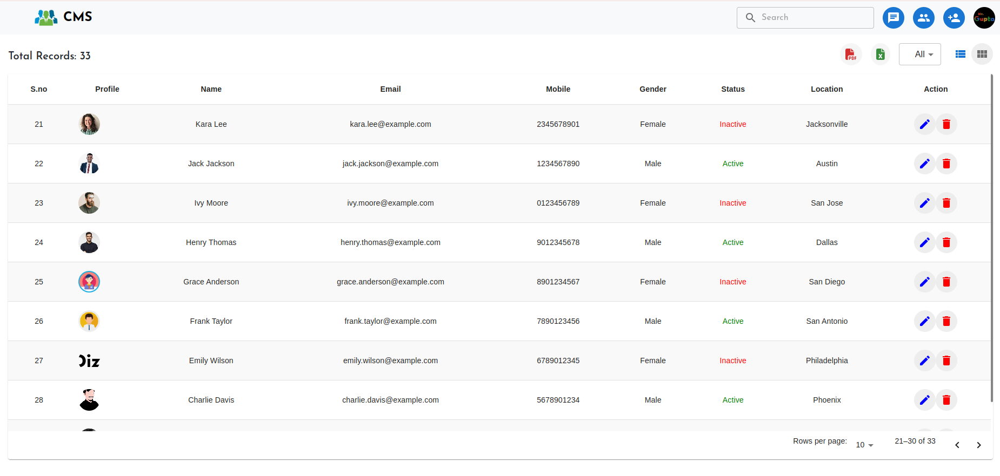
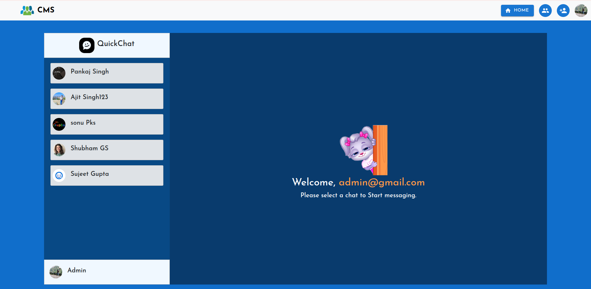

# CMS - Customer Management System Application (MERN)
CMS is Customer Management application build with the power of MERN Stack.

## Live Demo
You can view the live version of the application at the following link:

- [Live Demo](https://crud-react-5npz.onrender.com/)

For a detailed report, you can access the document here:

- [Project Report](https://docs.google.com/document/d/1rUK64OJBZFFG812lX9UB9fb7sucScTonmMGEUMSkpfw/edit?usp=sharing)


## ScreenShot





## Installation Guide

### Requirements
- [Nodejs](https://nodejs.org/en/download)
- [Mongodb](https://www.mongodb.com/docs/manual/administration/install-community/)

Both should be installed and make sure mongodb is running.
### Installation

```shell
git clone https://github.com/Itsmegupta/Customer-Management-System.git
cd CMS-react-nodejs
```

Now install the dependencies
```shell
cd server
npm i
cd ..
cd public
npm i
```
We are almost done, Now just start the development server.

For Frontend.
```shell
cd public
npm run dev
```
For Backend.

Open another terminal in folder, Also make sure mongodb is running in background.
```shell
cd server
npm start
```
Done! Now open http://localhost:5173/ in your browser.
